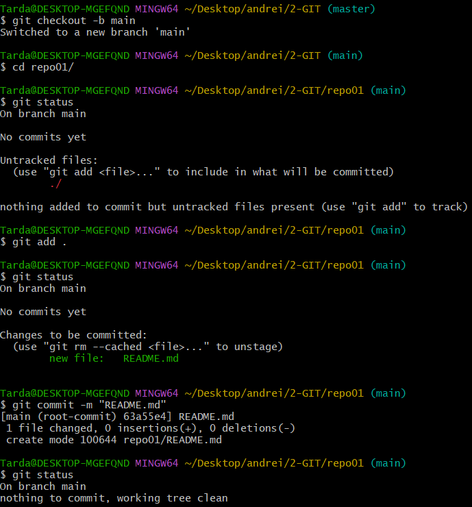
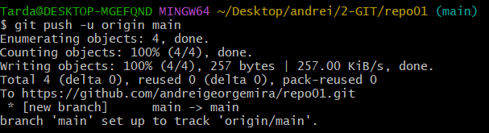

# Ejercicio GIT

## 1.1
Para identificar que un repo se ha iniciado, podemos verlo de varias maneras:
- Abrir la git bash y si esta el repo iniciado, nos sladra entre parentesis ens que branca estamos
- Activar para ver los ficheros ocultos y de esa manera ver si esta la carpeta llamada .git

## 1.2 
Este es el README.md que estas leyendo

## 1.3
Lo primero que hare es cambiar de branca de la master a la main. Luego haremos  un git add . para trackear el fichero, posteriormente haremos el commit. El fichero se encuentra en commited o lo que vendria a ser ya esperando para ser subido a la nube.

## 1.4
No nos deja hacer el push ya que no tenemos ningun repositiorio vinculado al repo local. Hay que crear un repositiorio en github para vincularlo con nuestro repositorio local y poder subir los cambios a la nube

## 1.5
No paraece nada porque no apuntamos a ningun repositorio de la nube

## 1.6
Creamos el repositorio

Enlazamos el repositorio local con el repo de la nube

Ya lo tenemos

## 1.7
Ya nos sale porque hemos enlazado el repo local con el repo de la nube que en este caso esta en GitHub

## 1.8
Para subir los cambios, al ser la primera vez que subimos algo, el comando de push es diferente al normal, hay que hacer un upstream

## 1.9
Lo que se puede observar que es peculiar es que el commit guarda el momento en el que se ha realizado, por ello, no sale que que se ha hecho en el momento del push si no que nos sale cuando se hizo, en mi caso 10 min 

